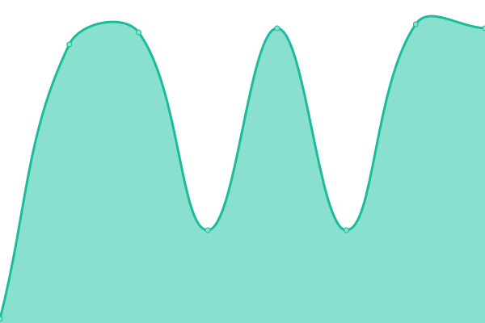

# [📈 Live Status](https://clarkwrks.github.io/resnet-status/): <!--live status--> **🟩 All systems operational**

This repository contains the open-source uptime monitor and status page for [John Clark](https://clarkwrks.github.io/resnet-status/), powered by [Upptime](https://github.com/upptime/upptime).

With [Upptime](https://upptime.js.org), you can get your own unlimited and free uptime monitor and status page, powered entirely by a GitHub repository. We use [Issues](https://github.com/clarkwrks/resnet-status//issues) as incident reports, [Actions](https://github.com/clarkwrks/resnet-status//actions) as uptime monitors, and [Pages](https://clarkwrks.github.io/resnet-status/) for the status page.

<!--start: status pages-->
<!-- This summary is generated by Upptime (https://github.com/upptime/upptime) -->
<!-- Do not edit this manually, your changes will be overwritten -->
<!-- prettier-ignore -->
| URL | Status | History | Response Time | Uptime |
| --- | ------ | ------- | ------------- | ------ |
|  [Main](https://www.nsercresnet.ca) | 🟩 Up | [main.yml](https://github.com/clarkwrks/resnet-status/commits/HEAD/history/main.yml) | 

 2525ms
     
 | 

<a href="https://status.xylemgeo.com/history/main">100.00%</a>
    

|  [Data Portal](https://data.nsercresnet.ca) | 🟩 Up | [data-portal.yml](https://github.com/clarkwrks/resnet-status/commits/HEAD/history/data-portal.yml) | 

 1219ms
     
 | 

<a href="https://status.xylemgeo.com/history/data-portal">100.00%</a>
    

|  [Document Library](https://docs.nsercresnet.ca) | 🟩 Up | [document-library.yml](https://github.com/clarkwrks/resnet-status/commits/HEAD/history/document-library.yml) | 

 100ms
     
 | 

<a href="https://status.xylemgeo.com/history/document-library">100.00%</a>
    

|  [Applications](https://apps.nsercresnet.ca/) | 🟩 Up | [applications.yml](https://github.com/clarkwrks/resnet-status/commits/HEAD/history/applications.yml) | 

 293ms
     
 | 

<a href="https://status.xylemgeo.com/history/applications">100.00%</a>
    

|  [Monteregie Storymap](https://apps.nsercresnet.ca/story/monteregie/) | 🟩 Up | [monteregie-storymap.yml](https://github.com/clarkwrks/resnet-status/commits/HEAD/history/monteregie-storymap.yml) | 

 60ms
     
 | 

<a href="https://status.xylemgeo.com/history/monteregie-storymap">100.00%</a>
    

<!--end: status pages-->

[**Visit our status website →**](https://clarkwrks.github.io/resnet-status/)

## 📄 License

- Powered by: [Upptime](https://github.com/upptime/upptime)
- Code: [MIT](./LICENSE) © [John Clark](https://clarkwrks.github.io/resnet-status/)
- Data in the `./history` directory: [Open Database License](https://opendatacommons.org/licenses/odbl/1-0/)
